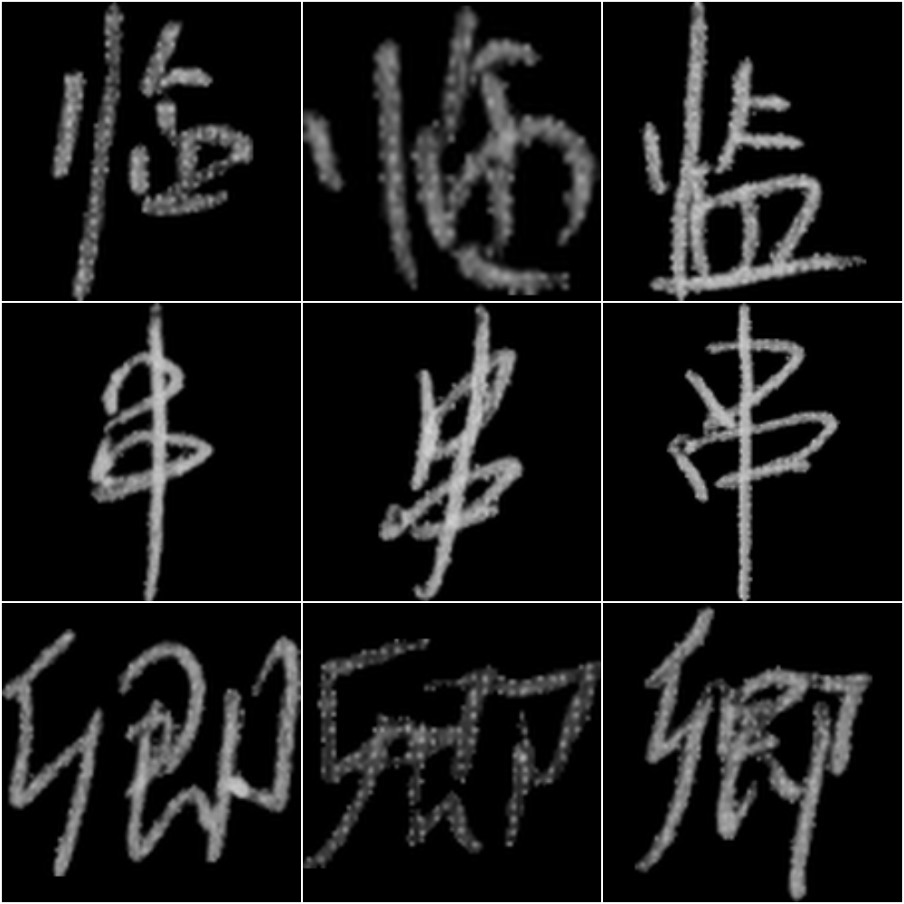
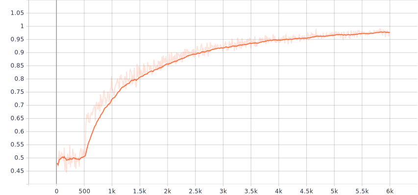

# Handwritten hanzi recognition
A chinese character is composed of smaller ones called 'radicals'. My aim was to create a NN for detection of radicals (one model, but with different weights for different radicals) in handwritten chinese characters. For this task I used a simplified version of Alexnet and the CASIA dataset of handwritten characters.

## Dataset
http://www.nlpr.ia.ac.cn/databases/handwriting/Home.html

~3500 characters, ~300 examples of each (in the training data)

#### Examples

## Results
Below is a chart of accuracy on training data over number of batches. Size of training batch in this case was 512, and the model was training for recognizing radical 耳.

## PyCasia
I am using a modified version of **PyCasia** python module:
https://github.com/lucaskjaero/PyCasia
licensed under Apache 2.0 License,

as well as **Imbalanced Data Sampler**:
https://github.com/ufoym/imbalanced-dataset-sampler
licensed under MIT License.
